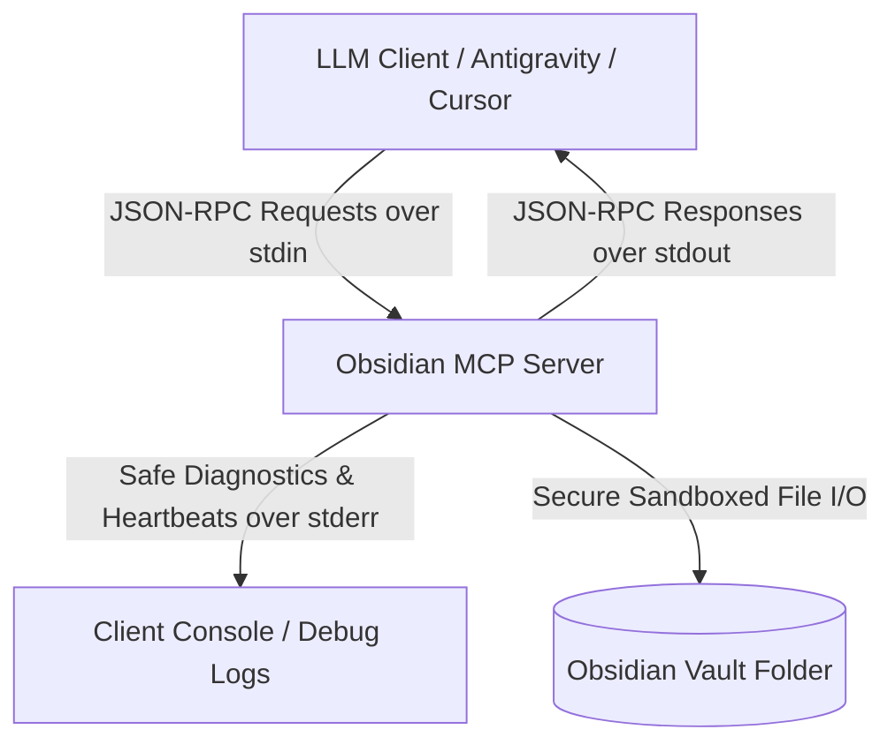

# Obsidian MCP Server (Rust)

[](https://www.rust-lang.org/)
[](https://modelcontextprotocol.io/)
[](https://opensource.org/licenses/MIT)
[](#)

A high-performance, ultra-secure, and robust **Model Context Protocol (MCP)** server written in Rust that exposes Obsidian Vault operations to LLM clients (such as Antigravity AI, Claude Desktop, Cursor, and other agentic interfaces). 

This server implements the formal MCP specification using high-fidelity JSON-RPC 2.0 framing over standard input/output (`stdio`), completely isolated from network interfaces to guarantee localized data sovereignty.

---

## 📖 Specialized User Manuals

To make setup and operations as seamless as possible, we have crafted dedicated manuals for both humans and AI agents:

- 🖥️ **[Human Installation Guide (INSTALLATION.md)](INSTALLATION.md)** — Step-by-step native setup guide, path configurations (`mcp_config.json` / `claude_desktop_config.json`), and visual checklists.
- 🤖 **[AI Agent System Manual (AI_INSTRUCTIONS.md)](AI_INSTRUCTIONS.md)** — Specialized behavioral guidelines, best practices for knowledge graph curation (`[[WikiLinks]]`), and operational directives for AI agents reading this repository.
- 📦 **[Pre-compiled Binary (/bin/)](bin/)** — Grab the standalone Windows binary (`obsidian_mcp.exe`) immediately.

---

## 🏗️ Architecture Overview

The server operates strictly over standard input (`stdin`) and standard output (`stdout`), communicating via JSON-RPC 2.0 frames. All system diagnostics, informational heartbeat logs, and runtime warnings are directed exclusively to standard error (`stderr`) to prevent the corruption of the JSON-RPC communication channel.



---

## 🔒 Rigorous Security & Guardrails

Obsidian vaults are local markdown folders, making secure path resolution a top priority. This server implements multi-layered, active security guardrails to completely neutralize path traversal attacks and system manipulation:

> [!IMPORTANT]
> **Active Host Safeguards:**
> - **Immediate Canonicalization:** The vault root folder is canonicalized (`std::fs::canonicalize`) on startup. All target files are structurally checked against this root path via `.starts_with()`.
> - **Anti-Traversal Filters:** Any incoming note title containing parent directory references (`..`), drive letters, or absolute paths (e.g. `C:\`, `/etc/passwd`) is immediately rejected before filesystem interaction.
> - **Windows Device Protections:** Actively blocks creation or reading of Windows reserved device names (e.g., `CON`, `PRN`, `AUX`, `NUL`, `COM1-9`, `LPT1-9`) that can lock up or corrupt Windows operating systems.
> - **Extension Enforcement:** Automatically forces the `.md` extension on all target files, preventing writing to scripts, configuration files, or arbitrary executables.

---

## 🛠️ Exposed MCP Tools

The server registers four core tools with the LLM client, allowing rich, programmatic manipulation of Obsidian notes:

### 1. `create_note`
Creates a brand-new Markdown note in the Obsidian vault, injecting a standardized YAML frontmatter block containing the current creation date and an array of tags.
- **Parameters:**
  - `title` (string, required): The title of the note. Subdirectories are supported (e.g. `Work/Projects/Q2-Goals`).
  - `content` (string, required): The core Markdown body of the note.
  - `tags` (array of strings, optional): Tags to inject into the frontmatter.
- *Safety Check:* Rejects operation if the target note already exists, preventing accidental overrides.

### 2. `append_note`
Appends new text content directly to the bottom of an existing note.
- **Parameters:**
  - `title` (string, required): The title of the note to append to.
  - `content` (string, required): The Markdown text to append.
- *Visual Design:* Automatically prefixes the new section with a clean, timestamped header: `## Update: YYYY-MM-DD HH:MM:SS`.

### 3. `read_note`
Reads and returns the full text content of an existing note.
- **Parameters:**
  - `title` (string, required): The title of the note.
- *Search Intelligence:* Features a recursive search fallback. If the exact path is not matched immediately, the server searches the entire vault case-insensitively to locate the note.

### 4. `search_vault`
Performs a recursive, case-insensitive, high-performance full-text search across all `.md` files in the vault.
- **Parameters:**
  - `query` (string, required): The case-insensitive query string to look for.
- **Returns:** A list of matching relative file paths (e.g. `["Inbox/Tasks.md", "Archive/OldNotes.md"]`).

---

## 🚀 Getting Started (Choose Your Route)

Rust compiles down to a **single, standalone, native executable** (`.exe` on Windows) with **zero runtime dependencies**. 

> [!TIP]
> **The Rust Advantage:**
> - **Zero Runtimes Needed:** No Node.js, Python, or Rust runtime environments are required to execute this server!
> - **Zero Dependency Executable:** You do **not** need to install the Rust compiler or Cargo unless you explicitly want to build the code from source.

---

### Option A: Direct Installation (Zero Setup - Recommended)

If you already have the pre-compiled `obsidian_mcp.exe` binary (e.g., inside [bin/obsidian_mcp.exe](bin/obsidian_mcp.exe) or downloaded from a release):

1. Place the `obsidian_mcp.exe` executable in a convenient folder on your machine.
2. Directly configure your MCP Client to point to the absolute path of that `.exe`. That is all! For step-by-step path settings, read the **[INSTALLATION.md](INSTALLATION.md)**.

---

### Option B: Build From Source (For Developers)

If you want to compile the server yourself from source:

1. **Prerequisite:** Install the standard [Rust & Cargo Toolchain](https://rustup.rs/).
2. Open your terminal, navigate to the project directory, and compile the optimized release binary:
   ```powershell
   cargo build --release
   ```
3. Your freshly minted, standalone executable is now built and available at:
   `target/release/obsidian_mcp.exe`

---

## 🔌 Configuration & Client Integration

The server requires the path to your target Obsidian vault. This path can be supplied in two ways:
1. An environment variable named `OBSIDIAN_VAULT_PATH`.
2. A CLI argument passed directly to the binary as the first parameter.

Read **[INSTALLATION.md](INSTALLATION.md)** for full detail on configuring environment variables or command-line parameters inside your client JSON files.

---

## 🛡️ License

This project is licensed under the MIT License - see the [LICENSE](LICENSE) file for details.
