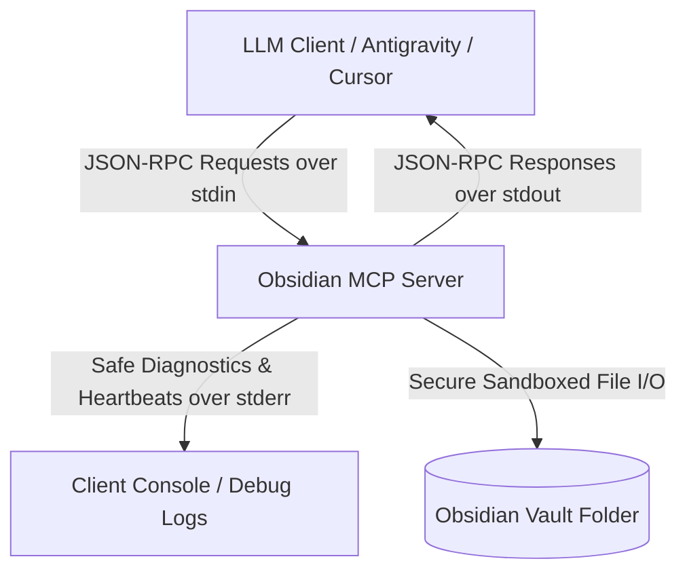

# Obsidian MCP Server (Rust)

[](https://www.rust-lang.org/)
[](https://modelcontextprotocol.io/)
[](https://opensource.org/licenses/MIT)
[](#)

A high-performance, ultra-secure, and robust **Model Context Protocol (MCP)** server written in Rust that exposes Obsidian Vault operations to LLM clients (such as Antigravity AI, Claude Desktop, Cursor, and other agentic interfaces). 

This server implements the formal MCP specification using high-fidelity JSON-RPC 2.0 framing over standard input/output (`stdio`), completely isolated from network interfaces to guarantee localized data sovereignty.

---

## 🏗️ Architecture Overview

The server operates strictly over standard input (`stdin`) and standard output (`stdout`), communicating via JSON-RPC 2.0 frames. All system diagnostics, informational heartbeat logs, and runtime warnings are directed exclusively to standard error (`stderr`) to prevent the corruption of the JSON-RPC communication channel.



---

## 🔒 Rigorous Security & Guardrails

Obsidian vaults are local markdown folders, making secure path resolution a top priority. This server implements multi-layered, active security guardrails to completely neutralize path traversal attacks and system manipulation:

> [!IMPORTANT]
> **Active Host Safeguards:**
> - **Immediate Canonicalization:** The vault root folder is canonicalized (`std::fs::canonicalize`) on startup. All target files are structurally checked against this root path via `.starts_with()`.
> - **Anti-Traversal Filters:** Any incoming note title containing parent directory references (`..`), drive letters, or absolute paths (e.g. `C:\`, `/etc/passwd`) is immediately rejected before filesystem interaction.
> - **Windows Device Protections:** Actively blocks creation or reading of Windows reserved device names (e.g., `CON`, `PRN`, `AUX`, `NUL`, `COM1-9`, `LPT1-9`) that can lock up or corrupt Windows operating systems.
> - **Extension Enforcement:** Automatically forces the `.md` extension on all target files, preventing writing to scripts, configuration files, or arbitrary executables.

---

## 🛠️ Exposed MCP Tools

The server registers four core tools with the LLM client, allowing rich, programmatic manipulation of Obsidian notes:

### 1. `create_note`
Creates a brand-new Markdown note in the Obsidian vault, injecting a standardized YAML frontmatter block containing the current creation date and an array of tags.
- **Parameters:**
  - `title` (string, required): The title of the note. Subdirectories are supported (e.g. `Work/Projects/Q2-Goals`).
  - `content` (string, required): The core Markdown body of the note.
  - `tags` (array of strings, optional): Tags to inject into the frontmatter.
- *Safety Check:* Rejects operation if the target note already exists, preventing accidental overrides.

### 2. `append_note`
Appends new text content directly to the bottom of an existing note.
- **Parameters:**
  - `title` (string, required): The title of the note to append to.
  - `content` (string, required): The Markdown text to append.
- *Visual Design:* Automatically prefixes the new section with a clean, timestamped header: `## Update: YYYY-MM-DD HH:MM:SS`.

### 3. `read_note`
Reads and returns the full text content of an existing note.
- **Parameters:**
  - `title` (string, required): The title of the note.
- *Search Intelligence:* Features a recursive search fallback. If the exact path is not matched immediately, the server searches the entire vault case-insensitively to locate the note.

### 4. `search_vault`
Performs a recursive, case-insensitive, high-performance full-text search across all `.md` files in the vault.
- **Parameters:**
  - `query` (string, required): The case-insensitive query string to look for.
- **Returns:** A list of matching relative file paths (e.g. `["Inbox/Tasks.md", "Archive/OldNotes.md"]`).

---

## 🚀 Getting Started

### 📋 Prerequisites
- **Rust Toolchain:** Install Rust and Cargo (edition 2021).

### ⚙️ Build the Server
Clone the repository and build an optimized release binary:

```powershell
# Navigate to the server folder
cd obsidian_mcp

# Build the release binary
cargo build --release
```

The compiled binary will be placed at:
- **Windows:** `target/release/obsidian_mcp.exe`
- **Linux/macOS:** `target/release/obsidian_mcp`

---

## 🔌 Configuration & Client Integration

The server requires the path to your target Obsidian vault. This path can be supplied in two ways:
1. An environment variable named `OBSIDIAN_VAULT_PATH`.
2. A CLI argument passed directly to the binary as the first parameter.

---

### 👾 Antigravity AI Integration

Antigravity operates with a global MCP manager config file. To integrate this server so your Antigravity agent can manage your notes:

1. **Locate your Antigravity MCP Config file:**
   - Open Windows Explorer and navigate to:
     `C:\Users\<YourUsername>\.gemini\antigravity\mcp_config.json`
     *(Alternatively, copy and paste `%USERPROFILE%\.gemini\antigravity\mcp_config.json` into your file explorer search bar).*

2. **Add the `obsidian` definition under `mcpServers`:**
   Open the `mcp_config.json` file in a text editor (like Notepad or VS Code) and add the following entry inside the `"mcpServers"` object:

   ```json
   "obsidian": {
       "command": "C:\\Antigravity projects\\Rust\\obsidian_mcp\\target\\release\\obsidian_mcp.exe",
       "args": [],
       "env": {
           "OBSIDIAN_VAULT_PATH": "C:\\Users\\YourUsername\\Documents\\ObsidianVault"
       }
   }
   ```
   *(Ensure you replace `YourUsername` with your actual Windows username and set `OBSIDIAN_VAULT_PATH` to the absolute path of your Obsidian vault. Use double-escaped backslashes `\\` for all Windows paths).*

3. **Restart the Antigravity session:**
   - Restart or start a new Antigravity session. The agent will automatically detect the new `obsidian` capabilities and begin servicing your requests using the vault!

---

### 💬 Claude Desktop Integration
To use this server with Claude Desktop, edit your `claude_desktop_config.json` (located at `%APPDATA%\Claude\claude_desktop_config.json` on Windows):

```json
{
  "mcpServers": {
    "obsidian-mcp": {
      "command": "C:\\Antigravity projects\\Rust\\obsidian_mcp\\target\\release\\obsidian_mcp.exe",
      "args": [],
      "env": {
        "OBSIDIAN_VAULT_PATH": "C:\\Users\\YourUsername\\Documents\\ObsidianVault"
      }
    }
  }
}
```

Alternatively, configure it using direct arguments:

```json
{
  "mcpServers": {
    "obsidian-mcp": {
      "command": "C:\\Antigravity projects\\Rust\\obsidian_mcp\\target\\release\\obsidian_mcp.exe",
      "args": ["C:\\Users\\YourUsername\\Documents\\ObsidianVault"]
    }
  }
}
```

---

### 🛰️ Cursor Integration
To configure the Obsidian MCP server in Cursor:
1. Open Cursor and navigate to **Settings** > **Cursor Settings** > **Features** > **MCP**.
2. Click **+ Add New MCP Server**.
3. Fill in the configuration:
   - **Name:** `obsidian-mcp`
   - **Type:** `command`
   - **Command:** `C:\Antigravity projects\Rust\obsidian_mcp\target\release\obsidian_mcp.exe "C:\Users\YourUsername\Documents\ObsidianVault"`
4. Click **Save** and verify that the status lights turn green.

---

## 🛡️ License

This project is licensed under the MIT License - see the [LICENSE](LICENSE) file for details.
